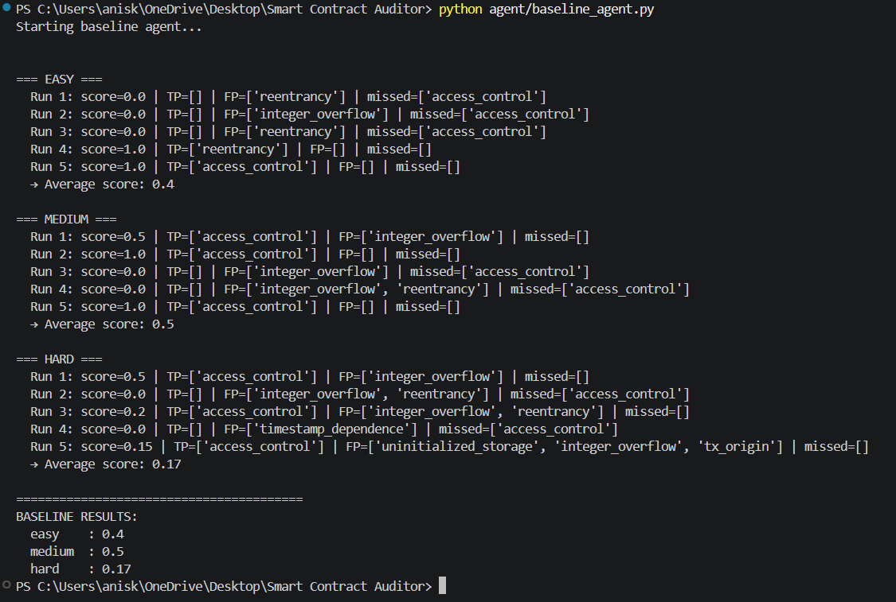
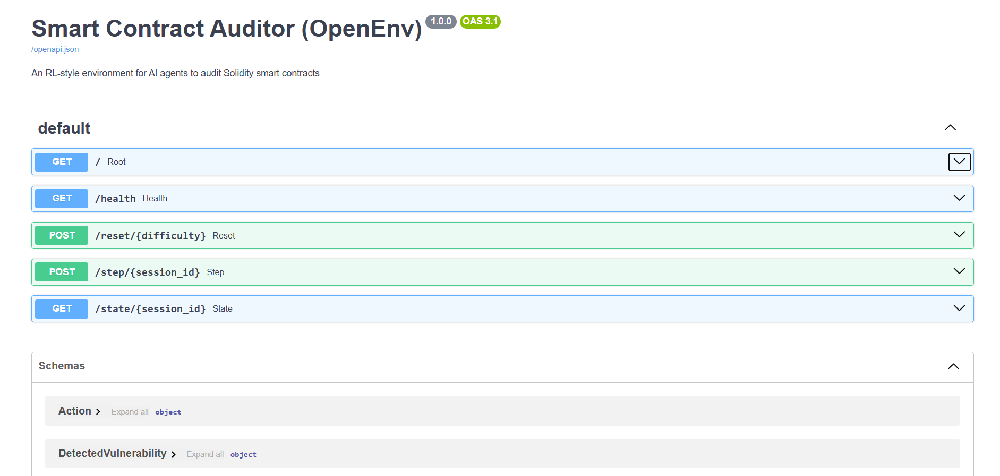

<div align="center">

# Smart Contract Auditor (OpenEnv)

**An RL-style environment for training and evaluating AI agents on real-world Solidity smart contract security auditing**

[](https://huggingface.co/spaces/YOUR_USERNAME/smart-contract-auditor)
[](https://github.com/YOUR_USERNAME/smart-contract-auditor)
[](LICENSE)
[](https://openenv.dev)
[](https://python.org)

<!-- SCREENSHOT: Add a screenshot of your /docs Swagger UI here -->
<!-- -->

</div>

---

## Overview

**Smart Contract Auditor** is a real-world task simulation environment built on the **OpenEnv API standard**. It models the workflow of a professional Web3 security auditor — an AI agent receives Solidity smart contract source code and must identify security vulnerabilities, classify their severity, and pinpoint their location.

The environment provides deterministic benchmark tasks, typed `step()` / `reset()` / `state()` interactions, and reproducible evaluation for OpenEnv-style agent benchmarking.

> **Why this matters:** Smart contract audits cost between $50,000–$500,000 per engagement. Automating vulnerability detection with AI agents has direct, measurable real-world value.

---

## Real-World Task

The agent simulates a **Web3 security auditor** performing the following workflow:

1. Receives a Solidity smart contract as input
2. Analyzes the code for known vulnerability patterns
3. Returns a structured audit report with vulnerability types, locations, severities, and explanations
4. Receives a reward score based on vulnerability type accuracy, location accuracy, and false positive penalties

### Official Benchmark Tasks

| Task ID | Difficulty | Contract | Expected Findings |
|---|---|---|---|
| `easy` | easy | `reentrancy_simple` | 1 reentrancy finding |
| `medium` | medium | `lotto` | 2 unchecked low-level call findings |
| `hard` | hard | `tokensalechallenge` | 3 arithmetic overflow findings |

---

## Environment Architecture

```
┌─────────────────────────────────────────────────────┐
│                  OpenEnv API                        │
│                                                     │
│   POST /reset/{difficulty}  →  Initial Observation  │
│   POST /step/{session_id}   →  Reward + Feedback    │
│   GET  /state/{session_id}  →  Current State        │
└─────────────────────────────────────────────────────┘
         │                        │
         ▼                        ▼
┌─────────────────┐    ┌──────────────────────┐
│  Contract DB    │    │   Grader + Reward     │
│  Deterministic  │    │   Type + Location     │
│  3-task suite   │    │   Match + Penalties   │
└─────────────────┘    └──────────────────────┘
```

---

## Project Structure

```
smart-contract-auditor/
│
├── auditor/
│   ├── environment.py       # Core OpenEnv class (reset, step, state)
│   ├── models.py            # Pydantic schemas (Action, Observation, Reward)
│   ├── grader.py            # Scoring logic (precision, recall, F1)
│   └── reward.py            # Reward shaping with FP penalties
│
├── agent/
│   └── baseline_agent.py    # Legacy local experiment (not submission baseline)
│
├── api/
│   └── server.py            # Legacy compatibility server
├── server/
│   └── app.py               # Canonical OpenEnv runtime entrypoint
├── client.py                # Lightweight HTTP client for inference
├── inference.py             # Competition-required baseline inference script
├── openenv.yaml             # OpenEnv metadata manifest
│
├── tasks/
│   ├── easy/                # Single-vulnerability contracts + ground truth
│   ├── medium/              # Two-vulnerability contracts + ground truth
│   └── hard/                # Multi-vulnerability contracts + ground truth
│
├── dataset/                 # SmartBugs Curated raw .sol files
├── parser.py                # Parses SmartBugs → tasks/ with ground truth JSON
├── vulnerabilities.json     # SmartBugs Curated ground truth annotations
├── Dockerfile
├── requirements.txt
└── README.md
```

---

## OpenEnv API

### `POST /reset/{difficulty}`

Starts a new episode. Returns an initial observation.

**Parameters:**
- `difficulty`: `easy` | `medium` | `hard`
- `session_id` (query param, optional): defaults to `"default"`
- `task_id` (query param, optional): deterministic benchmark task selection

**Response — Observation:**
```json
{
  "contract_code": "pragma solidity ^0.6.0; contract VulnerableBank { ... }",
  "task_id": "easy",
  "contract_id": "reentrancy_simple",
  "task_level": "easy",
  "objective": "Submit one structured audit report for a contract with exactly one real vulnerability.",
  "context": "This contract has exactly ONE vulnerability. Find only that one.",
  "attempt_number": 0,
  "allowed_vulnerability_types": ["reentrancy"],
  "info": {"task_id": "easy", "contract_id": "reentrancy_simple"}
}
```

---

### `POST /step/{session_id}`

Agent submits its audit report as an action.

**Request Body — Action:**
```json
{
  "vulnerabilities": [
    {
      "type": "reentrancy",
      "location": "withdraw(), line 14",
      "severity": "critical",
      "explanation": "External call made before state update — classic reentrancy pattern"
    }
  ]
}
```

**Response:**
```json
{
  "observation": { "contract_code": "...", "task_id": "easy", "contract_id": "reentrancy_simple", "task_level": "easy", "objective": "...", "context": "Benchmark submission recorded. Call reset() to start a new task.", "attempt_number": 1, "allowed_vulnerability_types": ["reentrancy"], "info": {"grader_score": 1.0} },
  "reward": 0.85,
  "done": true,
  "info": {
    "grader_score": 0.85,
    "precision": 1.0,
    "recall": 1.0,
    "matched_findings": [],
    "partial_matches": [],
    "unmatched_predictions": [],
    "missed_findings": []
  }
}
```

---

### `GET /state/{session_id}`

Returns current environment state.

```json
{
  "task_id": "easy",
  "contract_id": "reentrancy_simple",
  "difficulty": "easy",
  "attempt_number": 1,
  "done": true
}
```

---

## Typed Models (Pydantic)

### `Action`
| Field | Type | Description |
|---|---|---|
| `vulnerabilities` | `List[DetectedVulnerability]` | List of detected bugs |

### `DetectedVulnerability`
| Field | Type | Values |
|---|---|---|
| `type` | `VulnerabilityType` | `reentrancy`, `integer_overflow`, `access_control`, `tx_origin`, `timestamp_dependence`, `selfdestruct`, `uninitialized_storage` |
| `location` | `str` | e.g. `"withdraw(), line 14"` |
| `severity` | `Severity` | `low`, `medium`, `high`, `critical` |
| `explanation` | `str` | Human-readable reason |

### `Observation`
| Field | Type | Description |
|---|---|---|
| `contract_code` | `str` | Full Solidity source code |
| `task_level` | `str` | `easy`, `medium`, or `hard` |
| `context` | `str` | Difficulty hint for the agent |
| `attempt_number` | `int` | Current attempt count |

---

## Observation Space

| Property | Description |
|---|---|
| Type | Text (Solidity source code) |
| Format | Raw `.sol` file content |
| Size | 100 – 6,000 tokens depending on difficulty |
| Metadata | Task level, attempt number, context hint |

---

## Action Space

| Property | Description |
|---|---|
| Type | Structured JSON |
| Schema | List of `DetectedVulnerability` objects |
| Vulnerability types | 7 canonical types |
| Severity levels | 4 levels: low, medium, high, critical |

---

## Reward Function

Rewards are continuous (0.0 → 1.0) and shaped to penalize hallucination:

```python
base_score  = (0.6 × precision) + (0.4 × recall)
fp_penalty  = 0.2 per hallucinated reentrancy/overflow
            + 0.1 per other false positive
final_reward = base_score − fp_penalty − (0.05 × missed_bugs)
```

| Agent Behavior | Reward Effect |
|---|---|
| Correct vulnerability found | +score (via precision/recall) |
| False positive (reentrancy/overflow) | −0.20 |
| False positive (other type) | −0.10 |
| Missed vulnerability | −0.05 |
| Perfect audit | 1.0 |
| All false positives, no true hits | 0.0 |

---

## Task Levels & Dataset

Built on **[SmartBugs Curated](https://github.com/smartbugs/smartbugs-curated)** — 143 annotated real-world Solidity contracts organized by the DASP taxonomy.

| Level | Contracts | Vulnerabilities per Contract | Example |
|---|---|---|---|
| **Easy** | ~90 | Exactly 1 | Single reentrancy in `withdraw()` |
| **Medium** | ~35 | Exactly 2 | Reentrancy + access control |
| **Hard** | ~18 | 3 or more / multi-category | Obfuscated DeFi contract |

### Vulnerability Categories Covered

| Type | Description | Typical Severity |
|---|---|---|
| `reentrancy` | External call before state update | Critical |
| `integer_overflow` | Unchecked arithmetic (Solidity < 0.8) | High |
| `access_control` | Missing `onlyOwner` / auth checks | High |
| `tx_origin` | Auth via `tx.origin` instead of `msg.sender` | Medium |
| `timestamp_dependence` | `block.timestamp` used for randomness/logic | Medium |
| `selfdestruct` | Unprotected `selfdestruct` call | High |
| `uninitialized_storage` | Storage pointer bug | High |
| `unchecked_calls` | Unchecked low-level `send()` / `call()` result | Medium |

---

## Competition Baseline

The competition baseline is the repo-root `inference.py` script. It uses the **OpenAI client** only, reads `OPENAI_API_KEY` / `HF_TOKEN`, `API_BASE_URL`, `MODEL_NAME`, and `HF_SPACE_URL`, and emits the required `[START]`, `[STEP]`, and `[END]` lines.

For validator compatibility, the final reported task score is normalized into the open interval `(0, 1)`:

- exact `0.0` is emitted as `0.01`
- exact `1.0` is emitted as `0.99`

This normalization affects the final reported score in `[END]`, not the environment's internal reward logic.

<!-- SCREENSHOT: Add a screenshot of baseline agent terminal output here -->


### Benchmark Run

```bash
python inference.py
```

The legacy `agent/baseline_agent.py` file is retained only as an older local experiment and is not the submission baseline.

---

## Setup & Installation

### Prerequisites
- Python 3.11+
- Docker (for containerized deployment)
- An OpenAI-compatible API key via `OPENAI_API_KEY` or `HF_TOKEN`

### Local Setup

```bash
# 1. Clone the repository
git clone https://github.com/YOUR_USERNAME/smart-contract-auditor
cd smart-contract-auditor

# 2. Install dependencies
pip install -r requirements.txt

# 3. Run OpenEnv server
python server/app.py

# 4. Run competition baseline inference
python inference.py
```

The canonical submission runtime is `server/app.py`, which serves the standard OpenEnv endpoints used by `openenv validate --url ...`.

---

## 🐳 Docker

```bash
# Build
docker build -t smart-contract-auditor .

# Run
docker run -p 7860:7860 --env-file .env smart-contract-auditor

# Visit
# http://localhost:7860/docs
```

---

## API Docs (Swagger UI)

When running, visit `/docs` for the interactive Swagger UI where you can test all endpoints directly in the browser.

<!-- SCREENSHOT: Replace the line below with your actual screenshot -->


```
http://localhost:7860/docs
```

---

## Environment Variables

| Variable | Required | Description |
|---|---|---|
| `OPENAI_API_KEY` | Yes* | OpenAI or compatible API key |
| `HF_TOKEN` | Yes* | Optional fallback key used when `OPENAI_API_KEY` is unset |
| `API_BASE_URL` | No | LLM API base URL, default `https://api.openai.com/v1` |
| `MODEL_NAME` | No | Model name, default `gpt-4o-mini` |
| `HF_SPACE_URL` | No | Environment server URL, default `http://localhost:7860` |

`OPENAI_API_KEY` or `HF_TOKEN` must be present before running `inference.py`.

Example:
```
OPENAI_API_KEY=your_api_key_here
API_BASE_URL=https://api.openai.com/v1
MODEL_NAME=gpt-4o-mini
HF_SPACE_URL=http://localhost:7860
```

---

## Dataset Citation

This environment uses the **SmartBugs Curated** dataset:

> Ferreira Torres, C. et al. *SmartBugs: A Framework to Analyze Ethereum Smart Contracts*. ICSE 2020.

```bibtex
@inproceedings{ferreira2020smartbugs,
  title     = {SmartBugs: A Framework to Analyze Ethereum Smart Contracts},
  author    = {Ferreira Torres, Christof and others},
  booktitle = {Proceedings of ICSE 2020},
  year      = {2020}
}
```

---

## License

MIT License — see [LICENSE](LICENSE) for details.

---

<div align="center">

Built for the **OpenEnv Challenge** · Powered by **SmartBugs Curated** · Baseline via **OpenAI Client**

</div>
